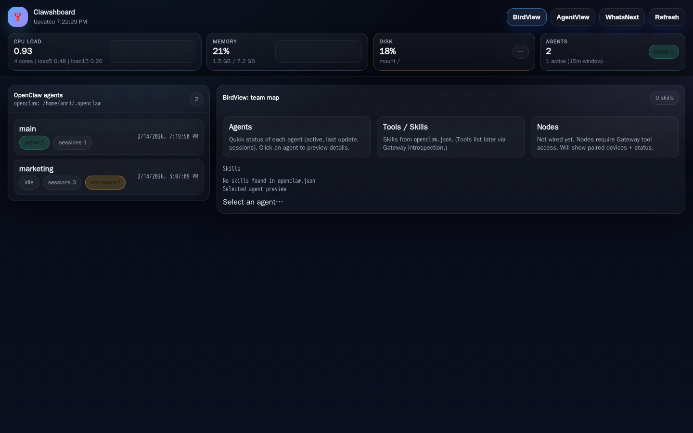

# The Clawshboard Dashboard

LAN-first mission control for OpenClaw.

**Goal:** a modern, mobile-friendly dashboard to observe your agent “team” (BirdView), drill into agents and sessions (AgentView), and track next actions (WhatsNext) — without exposing secrets.



## Why this exists
OpenClaw has great runtime capabilities, but day-to-day operation needs:
- a fast **hardware HUD** (CPU / memory / disk)
- a clear map of **agents + state**
- a safe way to edit “training”/ops files (`SOUL.md`, `MEMORY.md`, etc.)
- a canonical “what’s next” checklist per agent/project (`WHATSNEXT.md`)

Clawshboard is a lightweight web UI that reads OpenClaw state from disk and renders it in a clean, LAN-first dashboard.

## Current features
- Sticky “thick” header HUD with sparklines
- Views:
  - **BirdView** — at-a-glance team map (agents + skills)
  - **AgentView** — sessions table + session detail modal + allowlisted editor
  - **WhatsNext** — renders per-agent `WHATSNEXT.md` cards
- Multi-agent discovery from `~/.openclaw/agents/*`
- Safe editor (allowlist): `SOUL.md`, `USER.md`, `HEARTBEAT.md`, `MEMORY.md`, `TASKS.md`, `WHATSNEXT.md`
- Confirmation modal on writes + best-effort server-side backups (`.bak.<timestamp>`)

## Quick start

```bash
git clone <REPO_URL>
cd clawshboard
npm i
cp config.example.json config.json
npm run start
```

Open: `http://<host>:7010`

## Configuration
Edit `config.json`:
- `server.host` (default `0.0.0.0`)
- `server.port` (default `7010`)
- `paths.openclawHome` (default `~/.openclaw`)
- `paths.defaultWorkspace` (default `~/.openclaw/workspace`)

## Security notes
- No auth yet: **do not expose to the public internet**.
- Writes are restricted to an allowlist of filenames and constrained to an agent workspace.
- Clawshboard intentionally avoids committing tokens/credentials.

## Roadmap
See `docs/FEATURES.md`.

## License
MIT (see `LICENSE`).
